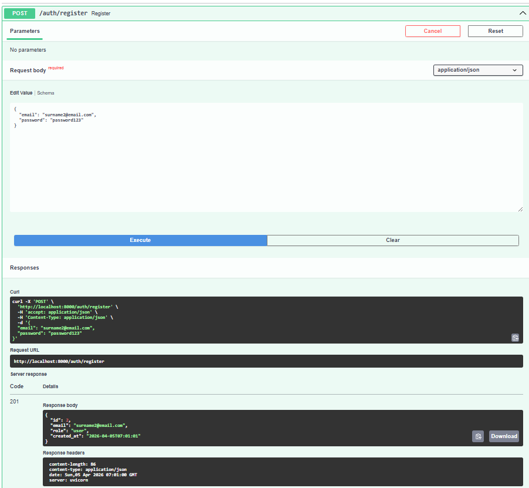
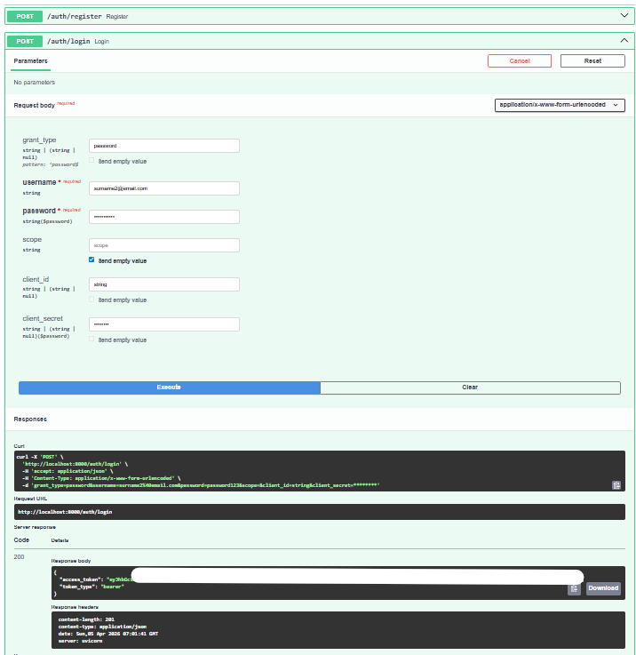
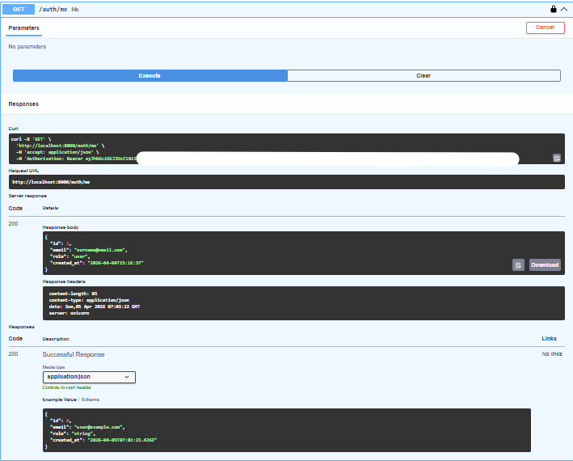
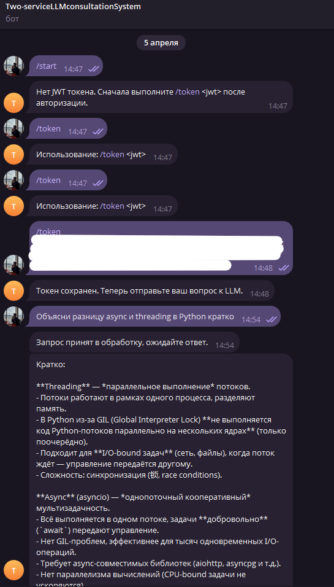
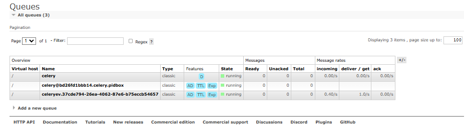
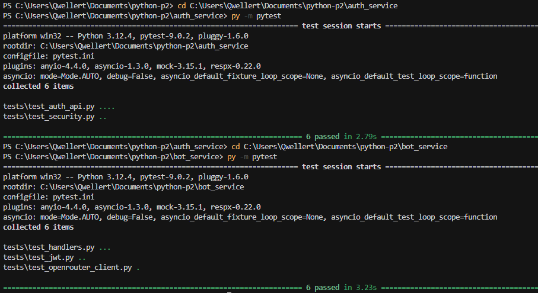

# Итоговый проект: двухсервисная система LLM-консультаций

## Кратко об архитектуре

Проект состоит из двух независимых сервисов:

- `auth_service` (FastAPI): регистрация, логин, выпуск JWT, endpoint `GET /auth/me`.
- `bot_service` (aiogram + Celery): прием JWT от пользователя в Telegram, валидация токена, отправка LLM-запроса в очередь.

Инфраструктура:

- `RabbitMQ` — брокер задач Celery.
- `Redis` — хранение JWT, связанного с `telegram_user_id`, и backend результатов.
- `OpenRouter` — внешний LLM API.

## Запуск

```bash
docker compose up -d --build
```

Проверка:

- Swagger Auth Service: [http://localhost:8000/docs#/](http://localhost:8000/docs#/)
- Bot API health: [http://localhost:8001/health](http://localhost:8001/health)
- RabbitMQ UI: [http://localhost:15672](http://localhost:15672) (`guest/guest`)

## Демонстрация работы (скриншоты)

### 1) Успешная регистрация в Auth Service (`POST /auth/register`, код `201`)



### 2) Успешный логин в Auth Service (`POST /auth/login`, код `200`, получение `access_token`)



### 3) Успешная проверка профиля (`GET /auth/me`, код `200`, авторизация по Bearer JWT)



### 4) Telegram-бот: передача JWT и получение ответа LLM



### 5) RabbitMQ: активные очереди Celery



### 6) Прохождение автотестов

На скриншоте показано успешное выполнение тестов в обоих сервисах:

- `auth_service`: `6 passed`;
- `bot_service`: `6 passed`.



## Вывод

Требуемый сценарий реализован:

- JWT выпускается только в `auth_service`;
- `bot_service` не хранит пользователей и не обращается к БД Auth Service;
- LLM-запросы выполняются асинхронно через `Celery + RabbitMQ`;
- Redis используется в рабочем контуре.
